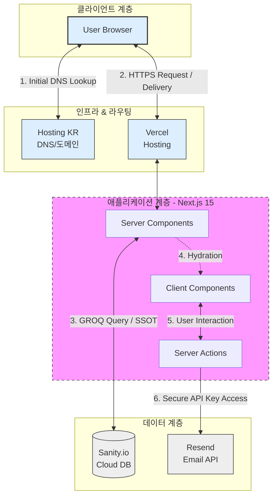
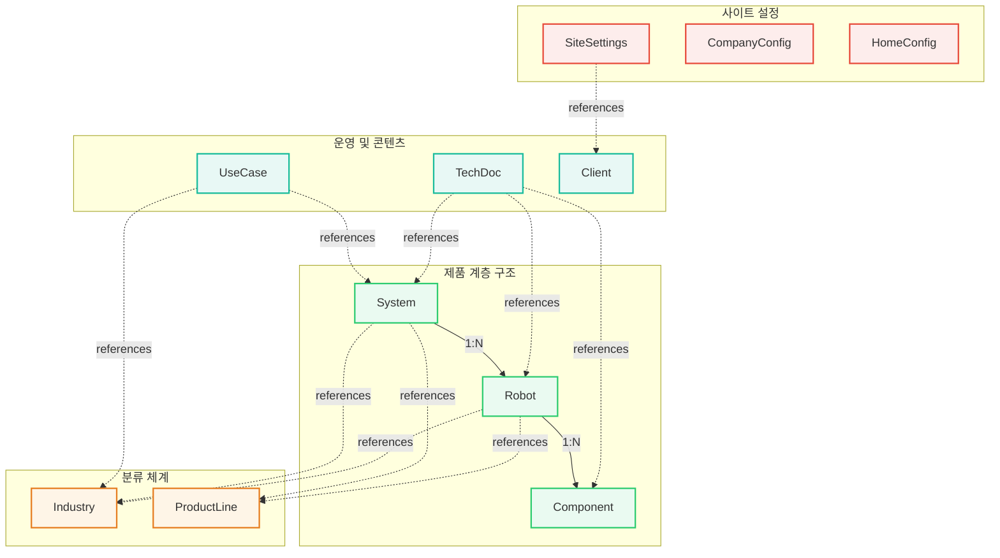

# G1sRobot: 하이엔드 로보틱스 솔루션 플랫폼

>**지속 가능한 운영 효율성과 시네마틱 UX를 결합한 기업용 플랫폼 구축**
>
>단순한 홍보 사이트를 넘어, 최신 기술 스택(Next.js 15)와 Headless CMS를 활용해 데이터와 코드를 완벽히 분리한 플랫폼입니다.

---

## 🔗 Links
- **Live Demo:** [g1srobot-robotics-iota.vercel.app](g1srobot-robotics-iota.vercel.app)

---
## 🚀 Key Performance & Achievements


**[Performance Optimization: Lighthouse Score]**
- Desktop 99점 / Mobile 89점 달성
- LCP(최대 콘텐츠 렌더링): 데스크톱 0.9s로 초고속 시각화 구현.
- CLS(레이아웃 변경): 0.004를 기록하여 레이아웃 흔들림 없는 안정적인 UX 제공.
- TBT(총 차단 시간): 10ms~20ms 수준으로 자바스크립트 실행 지연을 최소화하여 즉각적인 인터랙션 보장.
- SEO & Best Practices: 100점 만점 획득으로 웹 표준 및 검색 엔진 최적화 완수.
---

## ✨ Key Features

### 1. Next.js 15 & 인프라 최적화
서버리스 환경(Vercel)으로의 무중단 마이그레이션을 완수하고, 최신 비동기 API 규격을 선제 적용하여 런타임 안정성 확보.

### 2. 운영 생산성 향상(OX)
CMS 동기화를 통한 하드코딩 제거와 전용 운영 도구 구축으로 개발자 개입 없는 독립적 콘텐츠 관리 환경 조성.

### 3. 데이터 중심의 UX 설계
역참조 쿼리를 통한 스마트 필터링을 구현하여 사용자에게 '결과 없음(Dead-end)' 경험 차단 및 서버 사이드 데이터 전처리를 통한 클라이언트 부하 절감.

### 4. 엔지니어링 기반의 시각적 무결성
수학적 너비 계산과 브라우저 렌더링 결함(Sticky/Padding 등) 우회 설계를 통해 대화면에서도 흐트러짐 없는 광폭 UI 및 시네마틱 인터랙션 구현.

---

## 🛠️ Tech Stack

### Frontend & Design
<p>
  
  
  
  
  
  
</p>

### CMS & Infrastructure
<p>
  
  
  
  
  
  
  
</p>


#### 💻 Development Details
- **Next.js 15 & React:** 서버 컴포넌트(RSC)를 활용한 성능 최적화 및 최신 비동기 API 대응
- **TypeScript:** 엄격한 타입 정의를 통해 데이터 무결성을 확보하고 안정적인 유지보수 환경 구축
- **Tailwind CSS:** v4 규격 선행 학습 및 유틸리티 기반의 일관된 디자인 시스템 구축
- **Framer Motion:** 물리 엔진 기반의 정교한 인터랙션 구현을 통한 브랜드 가치 시각화
- **Node.js:** 안정적인 서버 사이드 런타임 환경 제공

#### 🎨 Design & Content Management
- **Figma:** 레이아웃 기획, 컴포넌트 구조 설계 및 SVG 에셋 추출을 통한 개발 일관성과 생산성 확보
- **Sanity.io:** 콘텐츠-코드 완전 분리 아키텍처 및 계층형 데이터 모델링
- **Resend API:** Server Actions와 연동하여 보안성이 강화된 문의 전송 시스템 구축

#### 🔧 DevOps & Maintenance
- **Vercel:** GitHub 연동 CI/CD 자동 배포 및 서버리스 함수(Serverless Functions) 인프라 활용
- **HostingKR:** 도메인 관리 및 Vercel 네임서버 연동을 통한 인프라 비용 최적화
- **Git & GitHub:** 버전 관리를 통한 프로젝트 형상 관리 수행 및 Vercel 연동 자동 배포 환경 구축

---

## 🏗 System Architecture



---

## 📊 Data Architecture

[전체 데이터 명세(Full ERD) 보러가기](https://dbdiagram.io/d/G1SRobot-CMS-ERD-6965e619d6e030a024dbf99c)



---

## 📂 Folder Structure

``` python
src/
 ├── app/               # Next.js App Router (Pages & Layouts)
 ├── components/
 │    ├── ui/           # 원자 단위 디자인 부품 (Button, Badge, Input)
 │    ├── elements/     # 기능적 모듈 (ProductCard, InquiryFormWrapper)
 │    ├── shared/       # 전역 공통 요소 (Nav, Footer, Hero)
 │    └── pages/        # 페이지 조립 계층
 ├── constants/         # 상수 및 정적 데이터
 ├── hooks/             # 커스텀 훅 (useInquiryForm 등)
 ├── lib/               # 유틸리티 및 API 클라이언트
 └── types/             # 데이터 타입 정의
```

---

## 💥 Critical Troubleshooting

### 01. 스크롤 인터랙션 경쟁 상태(Race Condition) 해결
**요약:** 앵커 클릭 이동 시 중간 섹션들이 중복 감지되는 상태(State) 업데이트 경쟁 현상 해결.
<details>
<summary>자세한 해결 과정 보기 (Click)</summary>

#### **[Problem]**
- 배경: 제품 라인업 페이지에서 `Intersection Observer`를 활용하여 사용자가 현재 보고 있는 섹션(제품군)을 실시간 감지하고 상단 메뉴에 `Active State`를 부여하는 `Scroll Spy` 기능을 구현함.
- 특정 메뉴 클릭 시 목적지로 이동하는 과정에서, 이동 경로상의 중간 섹션들이 순차적으로 감지되어 ActiveId 업데이트가 누적됨에 따라, 스크롤이 목표 지점 도달 전 중단되거나 상태가 어긋나는 인터랙션 결함 발생.
- 부가적 문제: 이동 중 브라우저가 스크롤 방향을 'Up'으로 오인하여 GNB가 불필요하게 노출되는 현상 동반.

#### **[Analysis]**
- **'클릭에 의한 수동 스크롤 이동 로직'**과 **'스크롤 위치에 따른 자동 Active 상태 감지 로직'**이 서로의 상태를 알지 못한 채 독립적으로 실행됨.
- 브라우저의 물리적 렌더링(Smooth Scroll)과 자바스크립트의 이벤트 루프(Observer) 간의 비동기적 시간차로 인한 경쟁 상태(Race Condition) 식별. -> 불필요한 `setActiveId` 호출이 경쟁적으로 발생하여 스크롤 목표 지점의 정확도를 방해함.
- 상단 섹션으로 이동 시 브라우저의 `window.scrollY` 값이 감소함에 따라, GNB의 스크롤 핸들러가 이를 사용자의 'Scroll Up' 의도로 오인하여 감추어져 있던 네비바를 강제 노출함.

#### **[Solution]**
- `useRef`를 활용한 **`isManualScrolling` 제어 플래그** 도입.
- 잠금 및 해제 메커니즘: 클릭 시점부터 이동 완료 시점까지 Observer와 GNB 스크롤 리스너의 동작을 일시 차단하여 로직 간 간섭을 제거.
- 이동 시작 전 `setActiveId`를 즉시 호출하여 사용자에게 즉각적인 시각적 피드백 제공.
- [[🔎상세 코드 보러가기]](https://github.com/g1robot00/g1srobot-robotics-website/blob/main/src/components/shared/hero/SubCategoryTab.tsx#L93-L112) 
    ```tsx
    const isManualScrolling = useRef(false); // 1. 제어 플래그

    // 2. 자동 상태감지 로직 (Scroll Spy)
    const observer = new IntersectionObserver((entries) => {
        if (isManualScrolling.current) return;  // 수동 이동 중 불필요한 상태 업데이트 차단
        // ... 상태 업데이트 로직
    });

    // 3. 수동 이동 로직
    const handleManualScroll = (id: string) => {
         const element = document.getElementById(id);
        if (element) {
            isManualScrolling.current = true;   // 잠금 시작
            setActiveId(id);                    // ui 선반영

            element.scrollIntoView({ behavior: 'smooth' });
            
        }
            
        setTimeout(() => {                      // 이동 완료 후 잠금 해제 및 좌표 동기화
            lastScrollY.current = window.scrollY; 
            isManualScrolling.current = false;
        }, 1200);
    };

    // 4. nav바 방향 감지
    useEffect(() => {
        const updateNavVisibility = () => {
            if (isManualScrolling.current) return;  // 수동 이동 중 GNB 내려오는 현상 방지
        //... 방향 감지 로직
        }

        window.addEventListener('scroll', updateNavVisibility);
        return () => window.removeEventListener('scroll', updateNavVisibility);
    }, []);
    ```

#### **[Learning]**
- 시스템 자동화보다 사용자 의도(User Intent)가 우선시되어야 함을 깨닫고, 렌더링과 무관한 동기적 상태 관리 도구로서의 `Ref` 활용 능력을 배양함.

</details>

### 02. URL 해시(#) 이동 시 스크롤 복원(Scroll Restoration) 결함 해결
**요약:** 브라우저가 저장된 픽셀값보다 URL 프래그먼트를 우선하여 #id 시작점으로 점프하는 현상을 URL 클린업 로직을 통해 해결.
<details>
<summary>자세한 해결 과정 보기 (Click)</summary>

#### **[Problem]** 
- 배경: 랜딩 페이지에서 특정 섹션으로 바로 진입할 수 있도록 `${path}#${id}` 형태의 URL 프래그먼트(Hash) 내비게이션을 구현함. 
- #id로 특정 섹션에 진입한 후, 스크롤하여 상세 정보를 탐색하다가 상세 페이지 진입 -> 이후 '뒤로가기'를 하면 브라우저가 이전 스크롤 위치를 기억하지 못하고 #id 시작점으로 점프함.
- 사용자가 탐색 중이던 맥락을 잃어버리고 다시 스크롤하는 경험 저하 발생

#### **[Analysis]**
- 브라우저가 히스토리 역행 시 기록된 스크롤 좌표값보다, 브라우저의 **네이티브 앵커 내비게이션(Native Anchor Navigation)**이 히스토리 기반 스크롤 복원보다 높은 우선순위를 가지는 특성을 파악함.

#### **[Solution]**
- `window.history.replaceState API`를 활용한 **URL 클린업 로직** 도입.
- 사용자가 의도한 해시 위치에 안착했다면, 더 이상 URL에 해시를 남겨둘 필요가 없다는 점에 착안함.
- [[🔎상세 코드 보러가기]](https://github.com/g1robot00/g1srobot-robotics-website/blob/main/src/components/pages/products/ProductContainer.tsx#L30-L38)
    ```tsx
    const pathname = usePathname();

    useEffect(() => {
        if (window.location.hash) {             // 1. 주소창 해시(#) 존재 확인
            const timer = setTimeout(() => {    // 2. 해시 위치로 초기 스크롤 시간 확보(0.5초)
                window.history.replaceState(null, "", pathname);    // 3. 현재 히스토리 기록을 유지하며 주소창의 해시만 제거
            }, 500);
            return () => clearTimeout(timer);
        }
    }, [pathname]);
    ```

#### **[Learning]**
- **사용자 맥락(User Context) 보존**의 중요성을 깨닫고, 브라우저의 Location 및 History API가 실제 스크롤 복원 로직과 어떻게 상호작용하는지 깊이 있게 이해함
- 선언적인 React 환경에서도 브라우저 네이티브 동작을 정밀하게 제어하기 위해, **명령적(Imperative) API를 전략적으로 활용**하여 프레임워크의 추상화 한계를 극복하는 능력을 배양함.

</details>

### 03. Full-bleed 가로 스크롤의 정밀 정렬 및 패딩 씹힘 현상 해결
**요약:** 
1. Full-bleed 캐러셀 구현 중 일반 본문과의 정렬 불일치를 뷰포트 동적 계산을 통해 해결.
2. 브라우저 렌더링 시 `padding-right`가 적용되지 않아 마지막 버튼이 잘리는 현상을 물리적 Spacer 도입으로 해결.

<details>
<summary>자세한 해결 과정 보기 (Click)</summary>

#### **[Problem]**
- 문제 1: 랜딩 페이지의 적용사례 섹션에서 Full-bleed 구현 중 본문 컨테이너와의 정렬이 어긋남.
- 문제 2: 마지막 버튼 뒤에 여백을 주기 위해 `padding-right`를 설정했으나 버튼이 화면 끝에 잘린 채로 멈추는 현상 발생.  

#### **[Analysis]**
- 원인분석 1: 중앙 정렬된 컨테이너(`mx-auto`) 밖에서 `w-full`로 배치된 요소의 내부 패딩을 화면 너비에 따라 동적으로 계산하지 못함.
- 원인분석 2: 브라우저가 가로 스크롤 박스(`overflow-x-auto`) 내의 자식 요소 크기를 계산할 때, 부모의 `padding-right` 공간을 스크롤 가능한 영역으로 인지하지 못하는 결함이 있음. 

#### **[Solution]**
- 해결방법 1: CSS 변수와 calc()의 결합하여 `--side-margin` 수치를 정의하고, **`calc((100vw - max-width) / 2 + padding)` 공식을 적용**해 전체 그리드 시스템과 정렬 라인 동기화.
- 해결방법 2: 브라우저가 무시하는 CSS 패딩 대신, **리스트 마지막 요소 뒤에 물리적 공간을 차지하는 투명 div(Spacer)를 배치**하여 우측 끝단 여백 강제 확보.
- [[🔎상세 코드 보러가기]](https://github.com/g1robot00/g1srobot-robotics-website/blob/main/src/components/pages/main/UseCaseSection.tsx#L75-L100)
    ```tsx
    <div className={cn(
        "flex overflow-x-auto snap-x",
        // 1. 왼쪽 시작점을 컨테이너 정렬 라인에 맞춤
        "xl:pl-[calc((100vw-1440px)/2+80px)] 3xl:pl-[calc((100vw-1840px)/2+80px)]"
    )}>
        {useCases.map(item => <UseCaseCard key={item.id} />)}
        {/* 2. 오른쪽 끝 도달 시 컨테이너 라인과 일치하는 여백을 위해 Spacer 배치 */}
        <div className="flex-shrink-0 xl:w-20 3xl:w-[calc((100vw-1840px)/2+80px)]" aria-hidden="true" />
    </div>
    ```

#### **[Learning]**
- 뷰포트 너비와 컨테이너 임계값 사이의 관계를 수학적으로 공식화하여 통제된 레이아웃을 구현하는 역량을 배양.
- CSS 속성만으로 해결되지 않는 브라우저 고유의 렌더링 결함을 구조적(Markup)으로 우회하여 해결하는 방식을 익힘.

</details>


### 04. Sticky 요소의 수치 기반 중앙 정렬 및 경계선 정합성 해결
**요약:** 브라우저 엔진이 `sticky` 요소의 정지 임계값을 계산할 때 `transform`으로 이동시킨 시각적 거리를 무시하는 특성을 파악, `calc()` 수식을 이용한 결정론적 설계를 통해 물리적 위치 불일치 해결.

<details>
<summary>자세한 해결 과정 보기 (Click)</summary>

#### **[Problem]**
- 배경: 랜딩 페이지의 제품 라인업 섹션에서 왼쪽의 긴 아코디언 본문이 스크롤되는 동안, 우측 이미지 박스는 사용자 시선에 맞춰 화면 중앙에 머무는 `sticky` 인터랙션 설계.
- `top: 50%`와 `translate-y: -50%`를 적용했을 때, 부모 컨테이너의 하단 경계선에 도달했을 때 이미지 박스의 절반이 빠져나간 채로 멈추거나 상단에서 비정상적으로 일찍 멈추는 물리적 위치 충돌 발생. 

#### **[Analysis]**
- 브라우저 렌더링 엔진은 `sticky` 요소의 정지 임계값(Boundary)를 계산할 때 `transform`으로 이동시킨 **시각적 거리(`translate`)를 계산에 포함하지 않고 요소의 원래 물리적 부피만을 기준으로 좌표 산출함**.
- `margin: auto`를 활용한 자동 계산 방식은 추가적인 DOM 계층(Wrapper)을 요구하며, 복합적인 flex 레이아웃 환경에서 브라우저별 미세한 오차 발생 가능성이 높음.

#### **[Solution]**
- 시각적 트릭인 `translate`를 완전히 제거하고, 요소의 높이를 기반으로 `calc(50vh - h / 2)` 수식을 이용한 **결정론적 설계(Deterministic Design)** 도입.
- 대화면(3xl) 환경에서 이미지 비중이 커짐에 따라 가변적 수치(300px → 375px)를 적용하여 정교한 중앙 정렬과 경계선 정지 로직을 구현.
- [[🔎상세 코드 보러가기]](https://github.com/g1robot00/g1srobot-robotics-website/blob/main/src/components/pages/main/ProductLineSection.tsx#L104-L115)

    ```tsx
    /* 수치 기반의 정밀 Sticky 제어 */
    <div className={cn('hidden lg:block', 
                    'lg:flex-[1.2] 3xl:!flex-[1.5]', 
                    'sticky top-[calc(50vh-300px)] 3xl:top-[calc(50vh-375px)]', // 50vh - (h/2)
                    'aspect-square min-h-[400px] max-h-[600px] 3xl:max-h-[750px]')}
    > 
        <ProductLineGallery .../>
    </div>
    ```

#### **[Learning]**
- 브라우저의 렌더링 파이프라인을 이해하고, 결과를 예측할 수 있는 결정론적 레이아웃 설계 역량을 확보함.
- `transform` 속성이 레이아웃 단계(Reflow)가 아닌 페인트 단계(Repaint)에 관여하며 발생하는 위치 계산의 한계를 명확히 파악함.

</details>


<details>
<summary>기타 트러블슈팅 항목 (더보기)</summary>

 #### 05. Next.js 15 비동기 API 대응
 - **문제:** `params` 및 `searchParams` 규격 변경에 따른 런타임 에러.
 - **해결:** `Promise` 타입을 활용한 선제적 `await Unwrapping` 패턴으로 마이그레이션 완료.

</details>

---

## 🔎 Implementation Deep Dive

### 1. 엔지니어링 Engineering 

<details>
<summary><strong>[컴포넌트 아키텍처] 관심사 분리와 결합도 해제</strong></summary>

- **4단계 계층형 구조 설계:** `components`폴더를 `ui`(원자), `elements`(기능 조각), `shared`(전역 공유), `pages`(조립 계층)로 폴더를 격리하여 유지보수성 극대화.
- **컴포넌트 합성(Slot) 패턴:** Next.js 15의 클라이언트 경계 확산(Infection) 문제를 해결하기 위해 서버 컴포넌트를 Slot(Props) 형태로 주입하는 아키텍처 채택. (*하이드레이션 비용 절감 및 서버-클라이언트 역할 분리*)
- **추상화(Abstraction)와 조립(Composition):** 단순 필드(Input)는 선언적으로 추상화하고, 복합 필드(Email)는 유연한 조립 방식을 채택하여 생산성과 확장성 동시 확보.
- **CustomEvent 기반 통신:** 전역 상태 도구를 사용하기엔 가벼운 독립적 컴포넌트 간의 동기화를 위해 브라우저 표준 API를 사용하여 GNB와 서브탭 간의 아키텍처 구축.
- **React Portal 레이어 독립:** Stacking Context 이슈를 해결하기 위해 모달 레이어를 DOM 최상단으로 격리.
- **다형성(Polymorphic) 컴포넌트:** `href` 유무에 따라 `Link`와 `button` 태그로 동적 전환되는 고기능성 버튼 설계(Conditional Wrapping).
- **Ref 전파(Forwarding):** forwardRef와 useRef를 활용해 복합 컴포넌트 내부의 말단 DOM 요소에 직접 접근하여 유효성 검사 및 포커스 제어 구현.
</details>

<details>
<summary><strong>[UX 엔지니어링] 비동기 인터랙션 및 렌더링 최적화</strong></summary>

- **Scroll Race Condition 해결:** `useRef` 플래그를 이용한 Lock/Unlock 메커니즘으로 자동 감지(Observer)와 수동 이동(Click) 간의 충돌 해결.
- **URL 클린업을 통한 히스토리 스택 최적화:** `History API(replaceState)`를 제어하여 URL 해시(#) 랜딩 후 프래그먼트를 제거, 브라우저 뒤로가기 시 픽셀 단위의 정확한 스크롤 복원 성공.

- **실시간 위치 감지(Scroll Spy):** Intersection Observer를 활용해 사용자의 스크롤 위치를 추적하고 네비게이션 상태를 실시간으로 동기화.
- **적응형 인터랙션(Adaptive Interaction):** 사용자의 디바이스와 조작 환경에 따라 컴포넌트의 배치를 유동적으로 변경.


- **데이터 가용성 기반의 인터페이스 제어:**  다형성 렌더링(Polymorphic Rendering)으로 처리하여 탐색 실패 경험(Dead-end)을 시스템적으로 차단하고 검색 로봇과 사용자 모두에게 정확한 가이드 제공.


</details>

<details>
<summary><strong>[UI 엔지니어링] 마이크로 인터랙션과 시각적 무결성</strong></summary>

- **Full-bleed 그리드 정렬:** `calc()`와 CSS 변수를 활용해 전역 그리드 라인과 일치하는 가변 패딩 설계 및 물리적 Spacer를 통한 브라우저 렌더링 결함(패딩 씹힘) 극복.
- **Sticky 포지셔닝 정합성**: `translate`의 물리적 한계를 인지하고 `calc()` 기반의 결정론적 좌표 계산으로 부모 경계 내 완벽한 중앙 정렬 구현.
- **레이아웃 무결성 유지:** `ImagePlaceholder`, `Typograpy 기반 min-h`, `가상 슬롯(Ghost Slot)` 배치를 통해 정보가 부족한 상황에서도 레이아웃 흔들림(Jank)를 방지하고 구글 Lighthouse CLS 점수 최적화.


- **에셋의 유지보수성 및 성능 최적화:** 외부 로고 파일을 Inline SVG 컴포넌트화하여 HTTP 요청을 최소화(Zero HTTP Request)하고, CSS 변수와 연동하여 실시간 테마 대응 및 코드 기반의 에셋 관리 환경 구축.
- **스타일 병합 유틸리티(cn):** tailwind-merge와 clsx를 결합한 cn 함수를 구축하여 클래스 우선순위 충돌 해결 및 스타일 확장성 확보.
- **시네마틱 스크롤 스토리텔링:** Framer Motion의 useScroll과 useTransform을 매핑하여 스크롤 위치에 반응하는 이미지 확대 및 타이포그래피 교차 페이딩 연출.
- **광폭 UI:** calc()와 CSS 변수를 활용하여 1440px, 1840px로 확장되는 레이아웃 설계. 대화면에서도 시각적 밀도를 유지하는 정밀한 정렬 구현.
- **Cubic-bezier 모션 시스템:** [0.4, 0, 0.2, 1] 표준 가속도를 토큰화하여 모든 애니메이션에 일관된 리듬감 부여.
</details>

### 2. 데이터 Data
<details>
<summary><strong>[데이터 모델링] 관계형 스키마 설계 및 SSOT 확보</strong></summary>

- **계층적 레퍼런스 모델링:** `System(시스템)` > `Robot(로봇)` > `Component(부품)`** 으로 이어지는 1:N 참조 관계 설계하여 데이터 무결성 확보.
- **단일 진실 공급원(SSOT) 구축:** 산업군과 제품군을 독립 엔티티로 분리하여 데이터 중복을 방지하고, 전사적인 데이터 정합성 유지.
- **참조 무결성(Referential Integrity):** 텍스트가 아닌 고유 ID(UUID) 기반의 참조 시스템 구축.
- **싱글톤 운영 아키텍처:** 사이트 전역 설정 데이터를 싱글톤으로 관리하여 데이터 중복을 방지하고 비개발자 운영자의 실수 방지 및 효율 증대.
- **부품화(Object) 설계:** 반복되는 데이터 구조(연락처, 연혁 항목 등)를 객체 타입으로 모듈화하여 스키마 재사용성 강화한 컴포지션(Composition) 기반 스키마 설계.
</details>
<details>
<summary><strong>[쿼리 최적화] 서버 사이드 데이터 전처리</strong></summary>

- **역참조 스마트 필터링:** `references()` 함수를 통해 실제 콘텐츠가 존재하는 카테고리만 동적으로 추출하여 '결과 없음' 페이지 노출 원천 차단.
    ```javascript
    const PRODUCT_TYPES_CONDITION = `_type in ["system", "robot"] && references(^._id)`;
    *[_type == "productLine" && count(*[${PRODUCT_TYPES_CONDITION}]) > 0] | order(orderRank asc) {
        "id": _id, ...
    }
    ```
- **다중 방어선(Fallback) 쿼리:** `coalesce()`와 `select()` 함수를 조합하여 데이터 누락 시 대표 이미지를 자동 호출하고 빈 데이터일 경우 기본 상태값을 보장하여 서버 단계에서 데이터 정합성 완성.
    ```javascript
    "thumbnail": select(showProduct != false => coalesce(mainImage.asset->url, images[0].asset->url), null)
    ```
- **상태 프로젝션:** 복잡한 비즈니스 로직을 쿼리 내 불리언(`Boolean`)으로 연산하여 전송함으로써 클라이언트 사이드 연산 부하 절감.
    ```javascript
    "hasContent": (showProduct != false) && defined(description) && count(specs) > 0
    ```
</details>

<details>
<summary><strong>[운영 효율화] CMS 커스터마이징</strong></summary>

- **자산 메타데이터 자동화:** `AssetTitleInput` 컴포넌트 개발. 파일 업로드 시 서버 에셋을 역조회하여 파일명을 제목 필드와 실시간 동기화하여 이미지 에셋 접근성 및 Technical SEO 대응.
- **그리드 사양 편집기:** @sanity/ui 기반의 `SpecsTableInput` 구축. 복잡한 배열 데이터를 엑셀 스타일로 관리하여 운영 생산성 향상.
    
    
- **전시 제어 시스템:** 기능 플래그(Feature Flag)와 전시 토글을 도입하여 재배포 없는 실시간 서비스 가동 제어 환경 구축.
    
- **코드-콘텐츠 완전 분리(Decoupled):** 모든 마케팅 텍스트와 에셋을 CMS로 관리하여 개발자의 개입 없는 실시간 사이트 운영 환경 구축
</details>

### 3. 보안/웹 표준/최신 기술
<details>
<summary><strong>[보안]</strong></summary>

- **Environment Scoping:** `NEXT_PUBLIC_ `접두사를 제어하여 민감한 API 시크릿을 클라이언트 번들 노출 방지.
- **Server Actions 격리:** 모든 외부 통신(Resend 등)을 서버 액션 내부에 은닉하여 클라이언트 측 정보 유출 위협 방어.
- **이중 검증(Dual Validation) 전략:** 클라이언트(JS)와 서버(Server Actions) 양측에서 데이터를 검증하여 비정상적인 접근 및 데이터 오염 방지.
</details>
<details>
<summary><strong>[웹 표준 & SEO]</strong></summary>

- **다형성 조건부 렌더링:** 데이터 상태에 따라 `Link`와 `Div` 태그를 동적으로 교체하여 검색 엔진 크롤링 효율과 사용자 경험 최적화.
- **WCAG 접근성 준수:** `aria-hidden`을 통한 레이아웃 노이즈 제거 및 구조화된 alt 텍스트 전략 수립.
- **이미지 최적화 가이드라인 준수:** 기기별 `sizes` 계산, `priority` 설정, Next.js 15의 이미지 퀄리티 화이트리스트 정책을 적용하여 LCP 성능 지표 개선.
- **메타데이터 전방 배치(Front-loading):** 메타데이터 전방 배치 전략을 통해 검색 엔진 색인 가용성 극대화.

</details>
<details>
<summary><strong>[최신 기술]</strong></summary>

- **Next.js 15 비동기 API 대응:** `params`, `searchParams` 등 비동기로 변경된 최신 프레임워크 규격을 준수하여 런타임 타입 안정성 확보.
- **Tailwind v4 엔진 활용:** 글로벌 테마 지시어를 통한 디자인 토큰 관리로 코드 기반의 일관된 디자인 시스템 구축.
</details>

---
## ⚙️ Getting Started 

- Node.js 18.18.0 이상 (v20 권장)

1. **Clone the repo & Install dependencies** 
```Bash
    git clone https://github.com/g1robot00/g1srobot-robotics-website.git

    cd g1srobot-robotics-website

    npm install
```

2. **Environment Variables**
_.env.local_ 파일을 생성하고 아래 키를 입력하세요.
```python
# Sanity CMS
NEXT_PUBLIC_SANITY_PROJECT_ID=#PUT_SANITY_PROJECT_ID
NEXT_PUBLIC_SANITY_DATASET=#PUT_SANITY_DATASET

# Resend (Email Service)
RESEND_API_KEY=#PUT_RE_API_KEY
EMAIL_ADDRESS=#PUT_EMAIL_ADDRESS

# kakaomap (Location)
NEXT_PUBLIC_KAKAO_MAP_API_KEY=#PUT_KAKAO_MAP_API_KEY
```

3. **Run development server**
```Bash
    npm run dev
```


